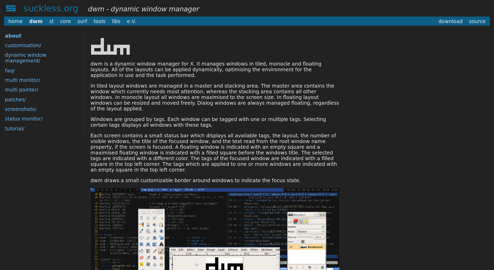

# Dark theme for suckless.org

## Preview

## Installation

### Firefox, Chrome
Make use of the addon **Stylus** for [Firefox](https://addons.mozilla.org/en-US/firefox/addon/styl-us/), [Chrome (based)](https://chrome.google.com/webstore/detail/stylus/clngdbkpkpeebahjckkjfobafhncgmne).

### Firefox alternative
- Unlock custom CSS usage:

`about:config` > `toolkit.legacyUserProfileCustomizations.stylesheets` > `true`

- Find profile folder by searching for `about:profiles` in the browser and search for the `default profile`.

- Create this directory and file in the right profile folder:

      $ mkdir ~/.mozilla/firefox/<profile_name>/chrome
      $ echo -e "@-moz-document domain('suckless.org'){\n$(cat suckless-dark.css)}" >> ~/.mozilla/firefox/<profile_name>/chrome/userContent.css

### Surf
Add the following line in the `styles` variable in your `config.h` file:

    { "suckless.org", "suckless-dark.css" },

Copy `suckless-dark.css` to your defined `styledir` directory.